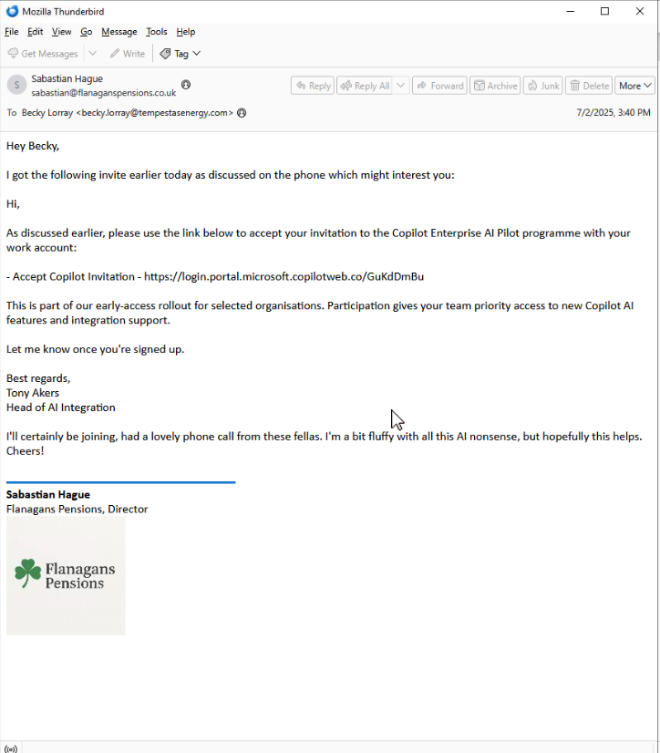
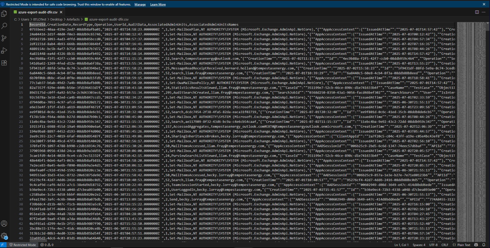
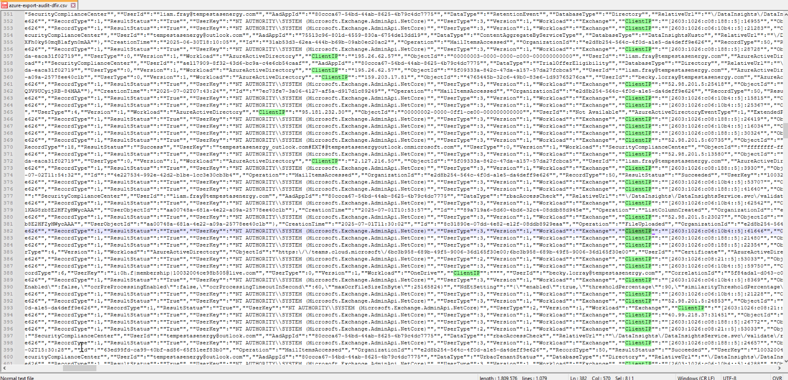
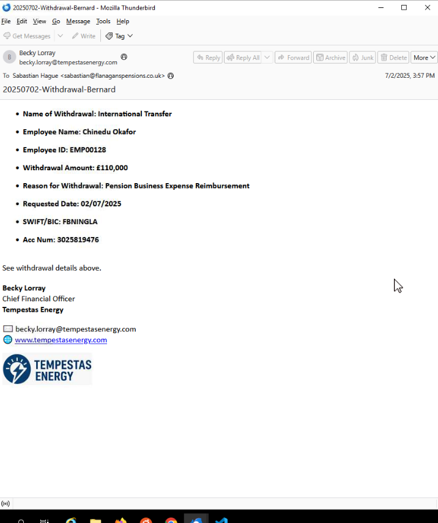
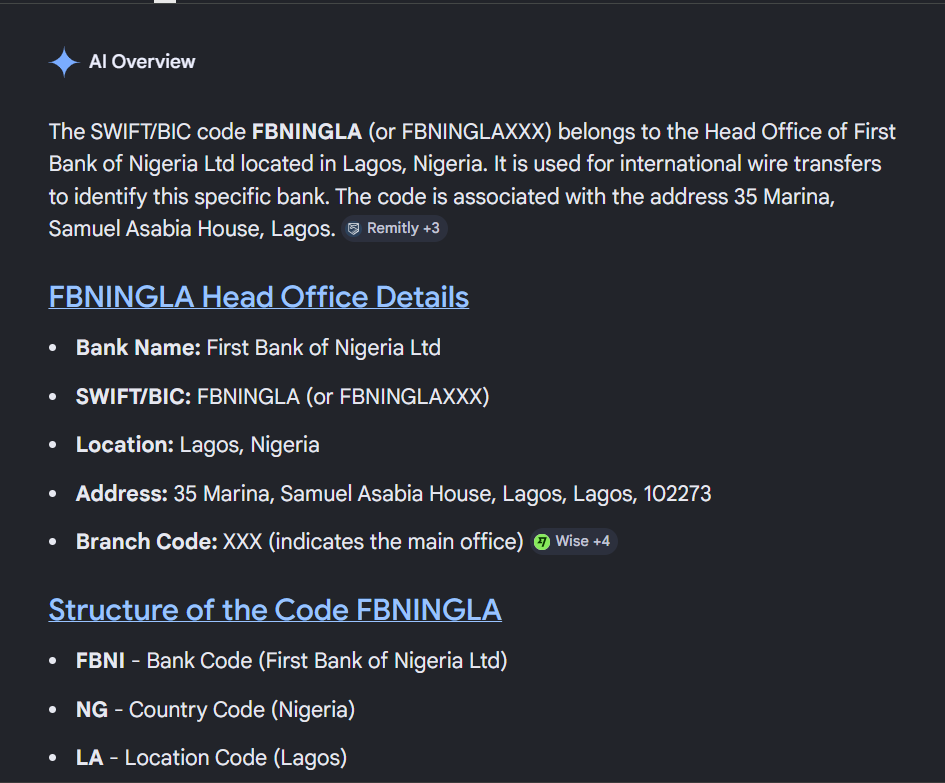

# BEC-KY: Business Email Compromise Investigation

Blue Team Labs Online DFIR investigation demonstrating phishing analysis, Microsoft Azure audit log investigation, mailbox rule abuse detection, and financial fraud analysis.

---

# Lab Overview

| Category | Details |
|--------|---------|
| Platform | Blue Team Labs Online |
| Scenario | BEC-KY |
| Attack Type | Business Email Compromise |
| Environment | Microsoft 365 / Azure |
| Tools Used | Notepad++, Email Analysis, Azure Audit Logs |
| Difficulty | Easy |
| Investigator | Marilyn Bergin |

---

# Scenario

The organization is facing a potential **high-impact financial cyber incident** centered around the company pension fund.

Within the past **48 hours**, several authorized bank transfers were processed moving large sums of money from the pension account to multiple external bank accounts.

The Chief Financial Officer (CFO) is responsible for approving these transactions, and investigators suspect the CFO’s account may have been compromised.

Evidence provided for investigation:

• Azure Audit Logs  
• Relevant email communications  

The objective is to determine how the compromise occurred and identify the attacker’s activity.

---

# Investigation Objectives

1. What is the source address of the initial phishing email?
2. What type of compromise is this?
3. What are the two IPs utilized by the threat actor?
4. Which bank was the transaction sent to?
5. What is the name of the inbox folder created during the compromise?
6. What word did the inbox rule search for before deleting emails?

---

# Step 1 – Evidence Review

The investigation began by reviewing the artifacts provided within the lab environment.

Evidence included:

• Email communications  
• Azure audit logs export (`azure-export-audit-dfir.csv`)

The audit logs were opened in **Notepad++** to allow easier searching and filtering through the large dataset.

---

# Step 2 – Identifying the Initial Phishing Email

During email review, a suspicious message was discovered sent from:

```
sabastian@flanaganspensions.co.uk
```

The email encouraged the recipient to accept an invitation to a **Microsoft Copilot Enterprise AI pilot program**.

The message contained the following link:

```
https://login.portal.microsoft.copilotweb.co/GukdDmBu
```

This domain **is not owned by Microsoft** and is a look-alike phishing domain designed to harvest credentials.

Legitimate Microsoft login domains typically include:

```
login.microsoftonline.com
portal.office.com
microsoft.com
```

The phishing link likely redirected the victim to a fake Microsoft login portal.

Once credentials were entered, the attacker gained access to the victim's Microsoft 365 mailbox.

---

## Screenshot Evidence

### Phishing Email Containing Malicious Copilot Link



---

# Step 3 – Determining the Type of Compromise

Based on the phishing email and the financial activity observed, the attack was identified as a **Business Email Compromise (BEC)**.

Typical BEC attack pattern:

1. Phishing email steals credentials
2. Attacker logs into corporate email
3. Internal communications are monitored
4. Inbox rules hide suspicious activity
5. Fraudulent financial transactions are executed

---

# Step 4 – Azure Audit Log Analysis

The Azure audit log file:

```
azure-export-audit-dfir.csv
```

was opened in **Notepad++** to analyze authentication and mailbox activity.

Using the search function, the logs were filtered using:

```
ClientIP
```

This field records the IP address used during authentication or mailbox access events.

Several IP addresses were identified belonging to Microsoft infrastructure such as:

```
52.x.x.x
IPv6 Microsoft service ranges
```

These were excluded since they represent legitimate Microsoft cloud operations.

---

## Threat Actor Infrastructure

Further correlation of authentication events revealed two external IPv4 addresses associated with suspicious activity.

```
159.203.17.81
95.181.232.30
```

These IP addresses appeared during authentication events related to the compromised account.

---

## Screenshot Evidence

### Azure Audit Logs



### Client IP Identification



---

# Step 5 – Identifying the Fraudulent Transaction Destination

The withdrawal email contained the following financial transfer information:

```
Name of Withdrawal: International Transfer
Employee Name: Chinedu Okafor
Employee ID: EMP00128
Withdrawal Amount: £110,000
SWIFT/BIC: FBNINGLA
Account Number: 3025819476
```

SWIFT/BIC codes uniquely identify financial institutions.

A lookup of the code:

```
FBNINGLA
```

revealed that it belongs to:

```
First Bank of Nigeria Ltd
```

Location: Lagos, Nigeria

This confirms the destination of the fraudulent transfer.

---

## Screenshot Evidence

### Withdrawal Request Email



### SWIFT/BIC Lookup



---

# Step 6 – Mailbox Rule and Folder Manipulation

Further Azure log analysis revealed that the attacker created a mailbox rule designed to hide financial communications.

A folder named:

```
History
```

was created within the mailbox.

The inbox rule contained the following parameter:

```
SubjectOrBodyContainsWords = Withdrawal
```

Emails containing the word **Withdrawal** were automatically moved into the **History** folder.

This technique prevented the victim from noticing fraudulent financial activity.

---

## Screenshot Evidence

### Malicious Folder Creation


### Inbox Rule Filtering Withdrawal Emails


---

# Investigation Findings

| Question | Answer |
|---|---|
| Phishing Email Source | sabastian@flanaganspensions.co.uk |
| Type of Attack | Business Email Compromise |
| Attacker IPs | 159.203.17.81, 95.181.232.30 |
| Fraudulent Bank | First Bank of Nigeria |
| Malicious Folder | History |
| Inbox Rule Keyword | Withdrawal |

---

# Executive Summary

This investigation identified a **Business Email Compromise (BEC)** attack targeting the company's pension fund.

The attacker delivered a phishing email impersonating a pension provider that redirected the victim to a fake Microsoft login portal.

After harvesting credentials, the attacker logged into the Microsoft 365 environment from external IP addresses.

To avoid detection, the attacker created an inbox rule that automatically moved financial emails into a hidden folder.

Using this access, the attacker initiated fraudulent pension withdrawal requests directing funds to a foreign bank account.

---

# Attack Timeline

| Phase | Description |
|------|-------------|
| Initial Access | Phishing email sent with fake Microsoft login link |
| Credential Harvesting | Victim credentials captured via phishing site |
| Account Access | Attacker logged into Microsoft 365 |
| Persistence | Inbox rule created |
| Defense Evasion | Emails hidden in "History" folder |
| Fraud Execution | Pension withdrawal request issued |
| Financial Destination | First Bank of Nigeria |

---

# Indicators of Compromise (IOCs)

### Malicious Email

```
sabastian@flanaganspensions.co.uk
```

### Phishing Domain

```
login.portal.microsoft.copilotweb.co
```

### Threat Actor IPs

```
159.203.17.81
95.181.232.30
```

### Malicious Inbox Rule

```
SubjectOrBodyContainsWords = Withdrawal
```

### Hidden Mailbox Folder

```
History
```

### Financial Destination

```
First Bank of Nigeria
SWIFT/BIC: FBNINGLA
```

---

# MITRE ATT&CK Mapping

| Technique | Description |
|----------|-------------|
| T1566 | Phishing |
| T1078 | Valid Accounts |
| T1114 | Email Collection |
| T1098 | Account Manipulation |
| T1564 | Hide Artifacts |
| T1657 | Financial Theft |

---

# Detection Opportunities

Organizations could detect this attack through:

• Suspicious login alerts from new locations  
• Detection of new inbox rule creation  
• Alerts for mailbox folder creation  
• Monitoring external login IP addresses  
• Financial transaction verification procedures  

---

# Lessons Learned

Business Email Compromise remains one of the most financially damaging cyber threats.

Attackers commonly:

• Steal credentials via phishing  
• Gain access to corporate email  
• Hide financial communications with inbox rules  
• Exploit financial approval processes  

Security teams should monitor mailbox rule creation, authentication anomalies, and financial communications.

---

# Skills Demonstrated

• Phishing email analysis  
• Microsoft 365 / Azure log investigation  
• Threat actor infrastructure identification  
• Financial fraud investigation  
• Mailbox rule abuse detection  
• Incident documentation  

---

# Author

Marilyn Bergin  
Cybersecurity Student – Purdue University  

GitHub  
https://github.com/mbergin123
